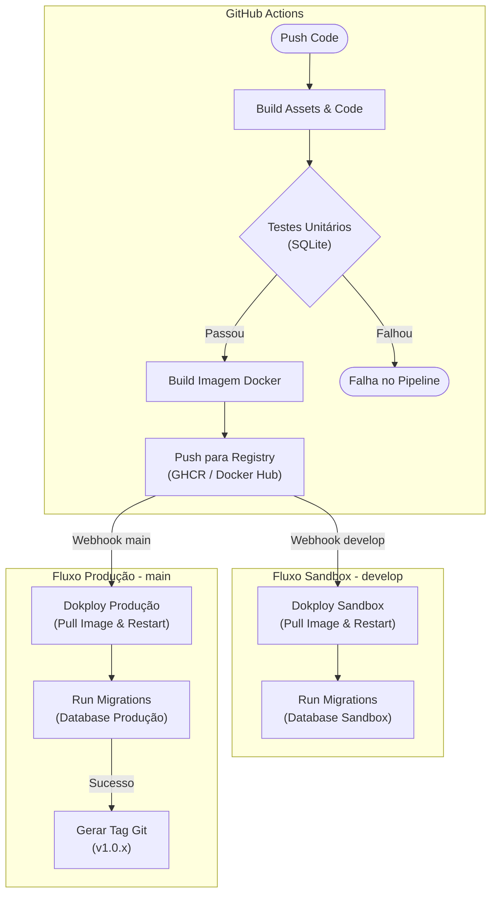

# Arquitetura de Pipeline CI/CD: GitHub Actions + Dokploy

Este documento detalha o fluxo padrão de Integração e Entrega Contínua (CI/CD) para aplicações Dockerizadas (ex: Laravel, Node.js) utilizando **GitHub Actions** para orquestração e **Dokploy** para gestão de infraestrutura.

---

## 1. Visão Geral da Arquitetura

O objetivo é garantir um ciclo de vida de software seguro, automatizado e rastreável, utilizando dois ambientes isolados:

1.  **Sandbox (Staging)**: Ambiente de testes integrado, espelhando a produção. Baseado na branch `develop`.
2.  **Produção**: Ambiente final para o usuário. Baseado na branch `main`.

### Conceitos Fundamentais

- **Build Imutável (Docker)**: Diferente de deploys baseados em transferência de arquivos (`rsync`), aqui geramos uma **imagem Docker** (artefato) e publicamos no registry. O recomendado é que o deploy utilize uma **tag imutável** (ex.: `:<commit_sha>`), garantindo que a imagem validada nos testes é exatamente a imagem implantada no ambiente alvo (sandbox/produção).

- **Infraestrutura como Código (Parcial)**: A definição do ambiente (serviços, volumes) é gerida pelo Dokploy, enquanto a orquestração do deploy reside no GitHub Actions.
- **Separação de Preocupações**:
    - **CI (GitHub)**: Responsável por garantir qualidade (testes) e criar o artefato (imagem).
    - **CD (GitHub -> Dokploy)**: Responsável por entregar o artefato no servidor e executar comandos de infraestrutura (migrations).

---

## 2. Fluxo de Trabalho Visual (Diagrama)

---

## 3. Detalhamento dos Fluxos

### 3.1. Fluxo de Desenvolvimento (`develop` -> Sandbox)

Este fluxo é acionado a cada `push` na branch `develop`. Ele serve para validar a integração do código novo com a infraestrutura real.

1.  **Build & Test**:
    - Instalação de dependências e compilação de assets.
    - Execução de testes automatizados (Pest/PHPUnit) usando **SQLite** em memória para velocidade.
2.  **Docker Build & Push**:
    - Criação da imagem Docker com uma tag **imutável** (recomendado: `:<commit_sha>`). Opcionalmente, também publicar uma tag “movível” (ex.: `:develop`) para conveniência.
    - Envio para o Registry privado.
3.  **Deploy (Webhook)**:
    - O GitHub aciona o **Deploy Webhook** do projeto "Sandbox" no Dokploy.
    - O Dokploy baixa a nova imagem e reinicia os containers (o impacto/downtime depende da estratégia configurada, quantidade de réplicas e health checks).
4.  **Database Migration**:
    - Após a subida do container, um comando remoto executa as migrations no banco de dados da **Sandbox**.

### 3.2. Fluxo de Produção (`main` -> Produção)

Acionado via Pull Request (PR) de `develop` para `main`. Assume-se que o código já foi validado na Sandbox.

1.  **Build & Test (Double Check)**:
    - Repete-se o processo de build e teste para garantir que nada quebrou no merge.
2.  **Docker Build & Push**:
    - Cria-se a imagem com uma tag **imutável** (recomendado: `:<commit_sha>` ou `:build-123`). Opcionalmente, também publicar `:latest` para conveniência, mas o deploy deve preferir a tag imutável para rastreabilidade.
3.  **Deploy (Webhook)**:
    - Aciona o Webhook do projeto "Produção" no Dokploy.
4.  **Database Migration**:
    - Executa migrations no banco de **Produção**. **Crítico**: Deve ser executado com flag `--force` para não pedir confirmação.
5.  **Release Tagging**:
    - **Apenas se tudo acima funcionar**: O pipeline automatizado cria uma Tag Git (ex: `v1.2.0`) e uma Release no GitHub. Isso marca o código exato que está rodando em produção com sucesso.

---

## 4. Estratégia de Migrations e Banco de Dados

Gerenciar banco de dados em pipelines automáticos exige cuidados especiais para evitar corrupção de dados ou downtime.

### Regras de Ouro

1.  **Non-Interactive**: O comando de migration deve sempre ter flags para não travar esperando input do usuário (ex: `--force` no Laravel).
2.  **Single Executor**: Em ambientes com múltiplas réplicas (escalonamento horizontal), **apenas UM** processo deve rodar a migration.
    - _Solução_: O pipeline conecta via SSH ou `docker exec` em _um_ container específico para rodar o comando, em vez de colocar o comando no `ENTRYPOINT` do Docker (que rodaria em todos).
3.  **Backwards Compatibility**: As migrations não devem quebrar o código que está rodando _antes_ do deploy terminar. Evite renomear colunas em uso; prefira criar nova -> migrar dados -> remover antiga em deploys futuros.

---

## 5. Configuração Técnica Necessária

### No Dokploy

1.  **Projetos Separados**: Crie dois projetos distintos, ex: `meuapp-sandbox` e `meuapp-prod`.
2.  **Deploy Webhook**: Em "Deployments" do serviço, habilite e obtenha a URL do Webhook de Deploy para cada ambiente.
3.  **Variáveis de Ambiente**: Configure `DB_HOST`, `APP_ENV`, etc., específicos para cada contexto.

### No GitHub (Secrets)

Configure as seguintes secrets no repositório:

| Secret                       | Descrição                                         |
| :--------------------------- | :------------------------------------------------ |
| `DOKPLOY_WEBHOOK_SANDBOX`    | URL para disparar o deploy em Sandbox             |
| `DOKPLOY_WEBHOOK_PRODUCTION` | URL para disparar o deploy em Produção            |
| `REGISTRY_USERNAME`          | Usuário do Docker Hub / GHCR                      |
| `REGISTRY_PASSWORD`          | Token/Senha do Docker Hub / GHCR                  |
| `SSH_HOST` / `SSH_KEY`       | (Opcional) Para rodar comandos pós-deploy via SSH |

---

## 5.1. Decisões do Projeto (Recomendado)

### Estratégia de tags de imagem

- **Tag imutável (recomendado)**: publicar e deployar usando `:<commit_sha>` (ou build number).
    - Vantagem: rastreabilidade e consistência total (o que foi testado é o que foi implantado).
- **Tag movível (opcional)**: `:develop` e/ou `:latest`
    - Vantagem: conveniência.
    - Atenção: tags movíveis podem apontar para imagens diferentes ao longo do tempo, então são menos confiáveis para auditoria.

### Como identificar a versão em execução

- Expor um endpoint `/version` (ou `/health`) retornando `APP_VERSION`/commit SHA.
- Injetar `APP_VERSION=<commit_sha>` como variável de ambiente no deploy.

---

## 6. Estrutura de Serviços Recomendada

Para aplicações robustas (ex: Laravel), recomenda-se dividir a aplicação em múltiplos serviços (containers) no Dokploy:

- **app-web**: Servidor HTTP (Nginx/Apache + PHP-FPM). Escalonável.
- **app-worker**: Processamento de filas em background.
- **app-scheduler**: Container dedicado para cron jobs (opcional, ou usar o cron do host).

> **Nota**: Todos esses serviços usam a **mesma imagem Docker**, apenas com comandos de inicialização diferentes. Isso simplifica o build.

---

## 7. Próximos Passos (Evolução)

Quando o projeto escalar, considere adicionar:

- **Rollback Automático**: Se o "Health Check" falhar após o deploy, reverter para a imagem anterior.
- **Testes E2E (End-to-End)**: Rodar Cypress/Playwright contra o ambiente de Sandbox antes de aprovar o PR para `main`.
- **Análise Estática (SonarQube)**: Adicionar step no CI para verificar qualidade de código e segurança.
